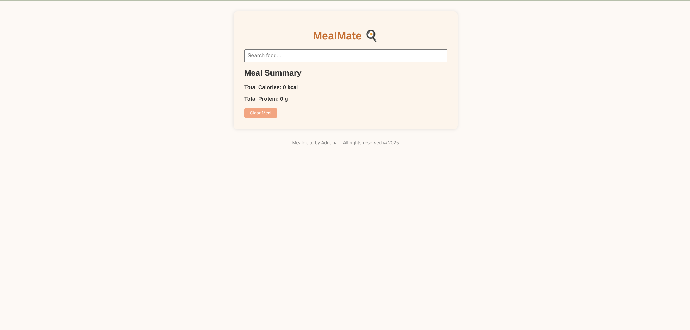
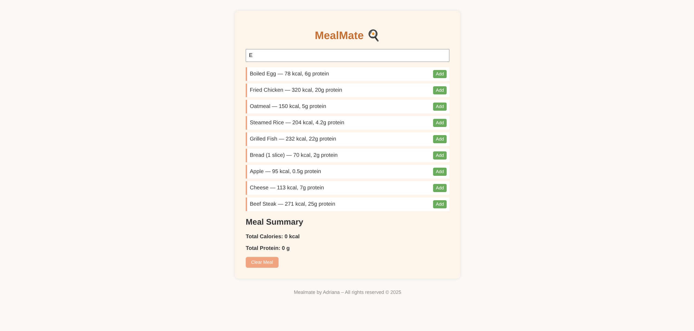
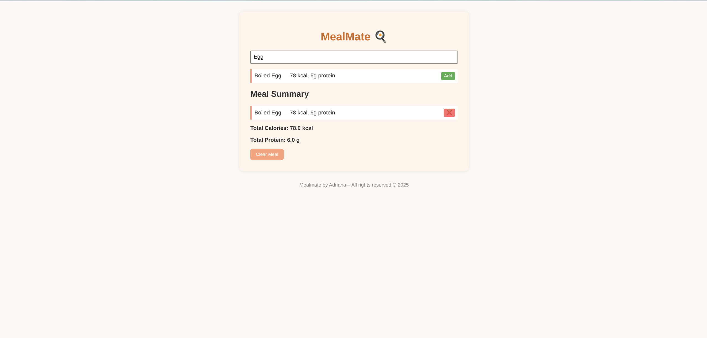

# 🍽️ MealMate

**MealMate** is a simple calorie and protein tracker built using **HTML, CSS, and JavaScript**. Users can search for foods from a predefined local list, add them to their meal, and view the total calories and protein for their current meal — all without using any backend or external APIs.

This project was built to showcase clean UI, DOM manipulation, and responsive design with no frameworks or dependencies.

---

## 📸 Screenshots

### 🏠 Landing Page

### 🔍 Food Search

### ➕ Add to Meal

---

## ✅ Features

- 🔍 Search for foods from a local JavaScript array
- ➕ Add selected foods to your current meal
- ❌ Remove items from the meal list
- 📊 See updated total calories and protein instantly
- 🖥️ Works on desktop and mobile browsers
- 🔌 Fully offline — no internet or server required

---

## 🛠️ Built With

- HTML5  
- CSS3  
- JavaScript (Vanilla)

---

## 📁 Folder Structure

mealmate/
├── index.html
├── style.css
├── script.js
├── README.md
├── screenshot-landing.png
├── screenshot-search.png
└── screenshot-add-meal.png

---

## 🌐 Live Demo

🔗 [Try MealMate Live](https://aeedev.github.io/mealmate/)

> Works best in modern browsers like Chrome, Firefox, and mobile Safari.

---

## © License

**MealMate by Adriana** 🍽️  
© 2025 — All rights reserved.
